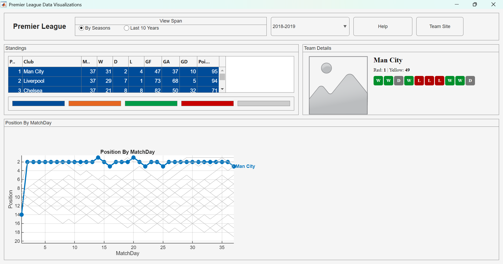

# Premier League MATLAB App

This repository contains a MATLAB programmatic UI (`PremierLeagueApp`) that replicates the core layout and interactions of the provided Premier League visualization screenshot.



## Features
- Standings table with row color coding (Champions League, Europa League, Qualifiers, Relegated) using `uistyle` when available (falls back to HTML cell styling).
- Team details panel: placeholder badge, red/yellow card counts, last 10 match W/D/L trend.
- Position by MatchDay plot for all teams, highlighting the selected team.
- Season dropdown (single season sample included; extendable).
- External link button to open team site (sample mapping).

## Quick Start
```matlab
% From repository root
addpath('src');
app = PremierLeagueApp;  % Launches the UI
```

## Extending Data
Edit `loadData()` in `PremierLeagueApp.m`:
1. Add a new `season` key (e.g. `'2019-2020'`).
2. Provide `teams`, `standings` structs (W/D/L etc.).
3. Provide `Positions` (teams x matchdays) matrix and card/results structures.
4. Add the season to the dropdown items list.

## Notes
- Row styling requires a relatively recent MATLAB version supporting `uistyle`. If unavailable, HTML fallback is used.
- Badge images can be placed in an `images/` folder and loaded by editing `updateSelection()`.
- This is a simplified model; numbers are sample / simulated.

## License
MIT License. See `LICENSE` file for details.
